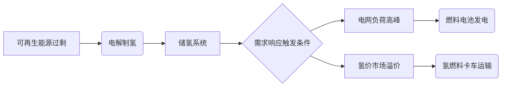

# demand_response
以下是为您整理的《氢赋能零碳智慧能源系统需求响应指导手册》，内容涵盖理论框架、技术路径、优化方法和实践案例，旨在为能源运筹优化研究提供系统性参考：

---

# **氢赋能零碳智慧能源系统需求响应技术手册**
## **1. 需求响应与氢能系统的耦合逻辑**
### 1.1 零碳能源系统特征
- **波动性矛盾**：风光发电量时空分布不均与刚性负荷需求的冲突
- **氢能调节优势**： 
  - 电-氢-电双向转换（电解槽→储氢罐→燃料电池）
  - 跨季节储能能力（储氢罐能量密度达120MJ/kg）
  - 多能耦合枢纽（衔接电力/热力/交通网络）

### 1.2 氢能需求响应核心价值


---

## **2. 氢能需求响应技术架构**
### 2.1 硬件系统组成
| 组件 | 技术参数 | 响应特性 |
|-------|---------|---------|
| PEM电解槽 | 效率60-70%，动态响应<1s | 可调节制氢功率匹配风电波动 |
| 液氢储罐 | 存储损耗<0.1%/天 | 提供72h以上持续调峰能力 |
| SOFC燃料电池 | 电效率55%，余热回收率30% | 支持热电联供需求响应 |

### 2.2 软件控制体系
- **多时间尺度优化**：
  - 日前市场：基于电价预测的制氢计划优化
  - 实时调控：频率响应（±2%额定功率调整速度）
- **数字孪生平台**：
  - 建立电解槽退化模型：累计运行小时数对效率的影响曲线
  - 储氢系统压力-温度耦合仿真

---

## **3. 需求响应优化模型**
### 3.1 目标函数
```
min Σ_{t=1}^T [C_grid(t)·P_grid(t) + C_H2(t)·Q_H2(t) + α·(SOC(t)-SOC_ref)^2]
```
- 约束条件：
  - 电解槽启停次数 ≤ 3次/日
  - 储氢罐压力维持20-70MPa安全范围
  - 燃料电池最小运行负荷率40%

### 3.2 求解算法对比
| 方法 | 适用场景 | 计算效率 |
|------|---------|---------|
| 混合整数规划 | 小规模系统精确解 | O(n³) |
| 深度强化学习 | 多不确定性场景 | 在线学习收敛时间>1000episodes |
| 分布式ADMM | 多园区协同响应 | 迭代次数≈log(1/ε) |

---

## **4. 典型应用场景**
### 4.1 工业园区案例
- **江苏某化工园实测数据**：
  - 配置：20MW PEM电解槽 + 500kg储氢 + 5MW燃料电池
  - 效果：平抑30%光伏波动，降低峰时购电成本42%

### 4.2 交通能源枢纽
- **德国H2 Mobility项目**：
  - 加氢站需求响应策略：
    - 电价低谷期制氢（<0.03€/kWh）
    - 交通高峰时段限制加氢速率（5kg/车→3kg/车）
  - 结果：运营成本降低28%，氢气利用率提升至91%

---

## **5. 关键技术创新方向**
### 5.1 设备层面
- 电解槽宽负荷运行技术（10%-150%额定功率）
- 储氢材料创新（MOFs材料吸附容量>5wt%）

### 5.2 系统层面
- 氢-电-热多能流联合仿真平台
- 基于区块链的绿氢溯源认证系统

### 5.3 市场机制
- 氢能容量市场设计
- 需求响应资源聚合商商业模式

---

## **6. 实施路线图**
1. **试点阶段（1-2年）**：
   - 建设10MW级氢能微网示范项目
   - 开发需求响应基线计算方法

2. **推广阶段（3-5年）**：
   - 建立跨区域氢能交易平台
   - 完善氢能需求响应标准体系

3. **成熟阶段（5-10年）**：
   - 实现氢能系统毫秒级需求响应
   - 构建智慧能源大脑（Hydrogen-AI调度系统）

---

**延伸研究建议**：
- 关注质子交换膜电解槽动态老化模型
- 探索氢储能参与电力现货市场的出清机制
- 开发面向氢能系统的数字孪生故障预测算法

建议结合NREL H2FAST、EnergyPlus等工具进行仿真验证，并关注DOE每年发布的氢能技术基准数据。


---

# **氢赋能的零碳智慧能源系统需求响应——初学者详解指南**

---

### **一、需求响应（Demand Response, DR）基础**
#### 1. **什么是需求响应？**
- **简单定义**：通过调整用户的用电行为或能源使用方式，让能源需求与供应更匹配的技术手段。
- **核心目标**：解决“发电”与“用电”在时间和空间上的不平衡（例如，风电光伏白天多、晚上少，但用电高峰可能在傍晚）。

#### 2. **需求响应的两种类型**
- **价格型**：用户根据电价变化主动调整用电（如低谷电价时充电）。
- **激励型**：电网或能源商通过补贴让用户临时减少用电（如工厂在用电高峰时停机）。

#### 3. **为什么需要需求响应？**
- **问题背景**：风光发电波动大，传统火电调节慢，导致“弃风弃光”或用电紧张。
- **氢能的角色**：将多余的可再生能源转化为氢气储存，需要时再发电或供能，成为灵活的“需求响应工具”。

---

### **二、氢能系统：零碳能源的“万能插座”**
#### 1. **氢能的全生命周期**
- **生产**：电解水制氢（用风光电）→ **绿氢**（零碳）。
- **储存**：高压气态、液态或固态储氢（像超大号充电宝，但能量密度更高）。
- **应用**：发电（燃料电池）、工业燃料、交通（氢燃料电池车）等。

#### 2. **氢能为何适合需求响应？**
- **跨时间调节**：可储存数月甚至更久（解决风光“夏天多、冬天少”的季节性问题）。
- **多场景应用**：电力、交通、工业用氢灵活切换（例如，电网缺电时用氢发电，氢车需求高时优先供交通）。

#### 3. **对比其他储能方式**
| 储能类型 | 优势 | 劣势 | 适合场景 |
|----------|------|------|----------|
| 锂电池   | 响应快（秒级） | 容量小、成本高 | 短时调频 |
| 抽水蓄能 | 容量大 | 依赖地理条件 | 日调节 |
| **氢储能** | 超大容量、跨季节 | 转换效率低（约50%） | 长期储能、多能联供 |

---

### **三、氢能如何参与需求响应？——三步走**
#### **步骤1：用电低谷期——制氢储能**
- **场景**：中午光伏发电过剩，电价低。
- **行动**：启动电解槽，将多余电力转化为氢气储存。
- **关键技术**：PEM电解槽（响应快，可跟随风电光伏波动）。

#### **步骤2：用电高峰期——氢能发电**
- **场景**：傍晚用电高峰，电价飙升。
- **行动**：用储氢罐中的氢气通过燃料电池发电，替代高价电网电。
- **优化目标**：降低用户电费，同时减少电网压力。

#### **步骤3：多能联供——灵活响应**
- **场景**：冬季供暖需求激增，同时电网负荷高。
- **行动**：燃料电池在发电时回收余热供暖，替代燃气锅炉。
- **效果**：同时满足电、热需求，减少碳排放。

---

### **四、技术细节与实例**
#### 1. **核心设备**
- **电解槽**：将水电解为氢气和氧气，效率约60-70%（即1度电可产约0.02kg氢）。
- **储氢罐**：高压（35-70MPa）或低温液态（-253℃）储存，损耗低于0.1%/天。
- **燃料电池**：将氢气转化为电和热，效率约50-60%。

#### 2. **实际案例：丹麦风氢社区**
- **背景**：风电占比超50%，但夜间风电过剩。
- **方案**：夜间用多余风电制氢，白天用氢能供电供暖。
- **结果**：社区能源自给率提升至80%，碳排放减少90%。

#### 3. **优化模型举例**
- **目标**：最小化总成本 = 购电成本 + 设备损耗成本。
- **约束条件**：
  - 储氢罐容量不能超限。
  - 电解槽每天最多启停3次（防止设备老化）。
- **求解方法**：混合整数规划（适合小规模系统）、强化学习（适合复杂场景）。

---

### **五、挑战与未来方向**
#### 1. **当前瓶颈**
- **成本高**：电解槽和燃料电池价格昂贵（约$1000/kW）。
- **效率损失**：电→氢→电转换效率仅约30-40%。
- **基础设施不足**：加氢站、输氢管网尚未普及。

#### 2. **突破方向**
- **技术创新**：研发高效低成本的电解槽（如阴离子交换膜AEM电解槽）。
- **政策支持**：制定绿氢补贴、碳税政策（如欧盟碳关税CBAM）。
- **商业模式**：氢能需求响应聚合商（整合小规模氢能资源参与电力市场）。

---

### **六、学习建议**
1. **入门资源**：
   - **书籍**：《氢能与燃料电池》（衣宝廉著）。
   - **工具**：用Python调用EnergyPlus模拟氢能系统，或使用NREL的HOMER软件做优化。
2. **关注领域**：
   - 氢能市场的电价联动机制。
   - 数字孪生技术在氢能系统中的应用（预测设备故障）。
3. **研究机构**：
   - 国际：国际能源署（IEA）氢能技术合作计划。
   - 国内：清华大学氢能实验室、中科院大连化物所。

---

**总结**：氢能需求响应的本质是“用氢能作为中介，把波动的可再生能源变成稳定可靠的能源”。作为初学者，建议从具体案例入手（如工业园区微网），逐步理解“电-氢-电”或“电-氢-热”的转换逻辑，再深入优化算法和市场机制。
