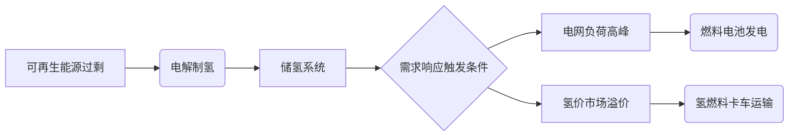

# demand_response
以下是为您整理的《氢赋能零碳智慧能源系统需求响应指导手册》，内容涵盖理论框架、技术路径、优化方法和实践案例，旨在为能源运筹优化研究提供系统性参考：

---

# **氢赋能零碳智慧能源系统需求响应技术手册**
## **1. 需求响应与氢能系统的耦合逻辑**
### 1.1 零碳能源系统特征
- **波动性矛盾**：风光发电量时空分布不均与刚性负荷需求的冲突
- **氢能调节优势**： 
  - 电-氢-电双向转换（电解槽→储氢罐→燃料电池）
  - 跨季节储能能力（储氢罐能量密度达120MJ/kg）
  - 多能耦合枢纽（衔接电力/热力/交通网络）

### 1.2 氢能需求响应核心价值


---

## **2. 氢能需求响应技术架构**
### 2.1 硬件系统组成
| 组件 | 技术参数 | 响应特性 |
|-------|---------|---------|
| PEM电解槽 | 效率60-70%，动态响应<1s | 可调节制氢功率匹配风电波动 |
| 液氢储罐 | 存储损耗<0.1%/天 | 提供72h以上持续调峰能力 |
| SOFC燃料电池 | 电效率55%，余热回收率30% | 支持热电联供需求响应 |

### 2.2 软件控制体系
- **多时间尺度优化**：
  - 日前市场：基于电价预测的制氢计划优化
  - 实时调控：频率响应（±2%额定功率调整速度）
- **数字孪生平台**：
  - 建立电解槽退化模型：累计运行小时数对效率的影响曲线
  - 储氢系统压力-温度耦合仿真

---

## **3. 需求响应优化模型**
### 3.1 目标函数
```
min Σ_{t=1}^T [C_grid(t)·P_grid(t) + C_H2(t)·Q_H2(t) + α·(SOC(t)-SOC_ref)^2]
```
- 约束条件：
  - 电解槽启停次数 ≤ 3次/日
  - 储氢罐压力维持20-70MPa安全范围
  - 燃料电池最小运行负荷率40%

### 3.2 求解算法对比
| 方法 | 适用场景 | 计算效率 |
|------|---------|---------|
| 混合整数规划 | 小规模系统精确解 | O(n³) |
| 深度强化学习 | 多不确定性场景 | 在线学习收敛时间>1000episodes |
| 分布式ADMM | 多园区协同响应 | 迭代次数≈log(1/ε) |

---

## **4. 典型应用场景**
### 4.1 工业园区案例
- **江苏某化工园实测数据**：
  - 配置：20MW PEM电解槽 + 500kg储氢 + 5MW燃料电池
  - 效果：平抑30%光伏波动，降低峰时购电成本42%

### 4.2 交通能源枢纽
- **德国H2 Mobility项目**：
  - 加氢站需求响应策略：
    - 电价低谷期制氢（<0.03€/kWh）
    - 交通高峰时段限制加氢速率（5kg/车→3kg/车）
  - 结果：运营成本降低28%，氢气利用率提升至91%

---

## **5. 关键技术创新方向**
### 5.1 设备层面
- 电解槽宽负荷运行技术（10%-150%额定功率）
- 储氢材料创新（MOFs材料吸附容量>5wt%）

### 5.2 系统层面
- 氢-电-热多能流联合仿真平台
- 基于区块链的绿氢溯源认证系统

### 5.3 市场机制
- 氢能容量市场设计
- 需求响应资源聚合商商业模式

---

## **6. 实施路线图**
1. **试点阶段（1-2年）**：
   - 建设10MW级氢能微网示范项目
   - 开发需求响应基线计算方法

2. **推广阶段（3-5年）**：
   - 建立跨区域氢能交易平台
   - 完善氢能需求响应标准体系

3. **成熟阶段（5-10年）**：
   - 实现氢能系统毫秒级需求响应
   - 构建智慧能源大脑（Hydrogen-AI调度系统）

---

**延伸研究建议**：
- 关注质子交换膜电解槽动态老化模型
- 探索氢储能参与电力现货市场的出清机制
- 开发面向氢能系统的数字孪生故障预测算法

建议结合NREL H2FAST、EnergyPlus等工具进行仿真验证，并关注DOE每年发布的氢能技术基准数据。
